# miniRT

A basic raytracer for 42 school project **miniRT**.


## *️⃣ Features

Create scenes containing varied shapes, meshes and lights, and render them through the technique of ray-tracing.

Each scene is configured in **.rt** files. See _documentation.rt_ for more information.

This project comes with a few pre-made scenes, meshes, textures and materials to select from.

#### Shapes
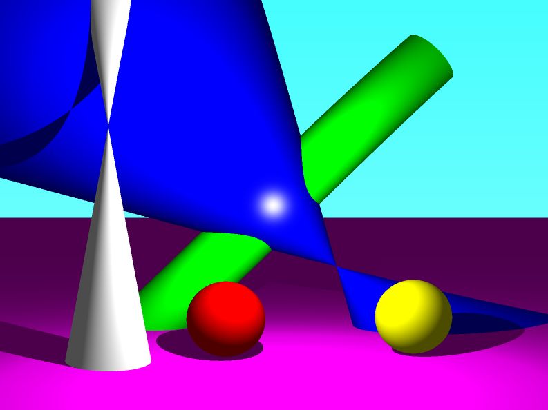

- Four primitive shapes available: plane, sphere, cylinder, cone.
- The shapes are fully configurable : size, position, orientation, etc...
- They can be seen from the outside as well as inside.
- Light that does not hit any object goes into the sky, which can be configured as a horizontal gradiant of two colors.

#### Materials and textures
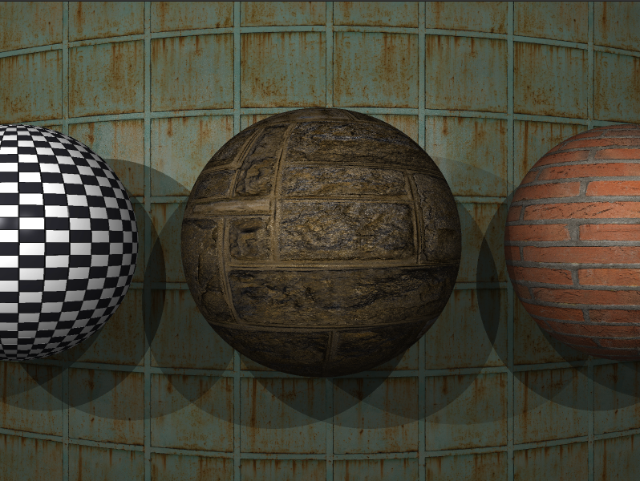
- Materials can be created in dedicated **.mrt** files (see documentation.mrt for more details).
- They contain all the visual parameters of the objects :
	- Colors : diffuse, ambiant and specular
	- Texture (in .xpm file format)
	- Normal map (in .xpm file format)
	- Physical properties : specularity, reflectivity, transparency and refractive index

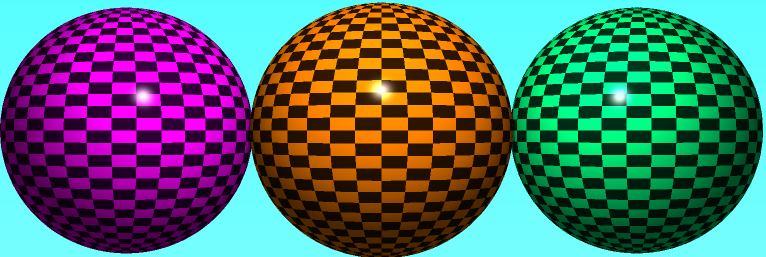
<p align="center">Texture colors are blended with the material color</p>

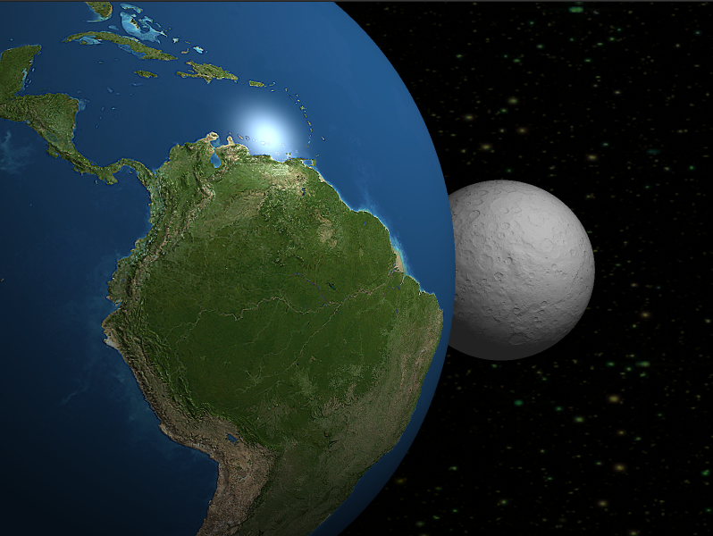
<p align="center"> A space scene with a normal map for the moon and texture and normal map for the earth </p>

#### Light

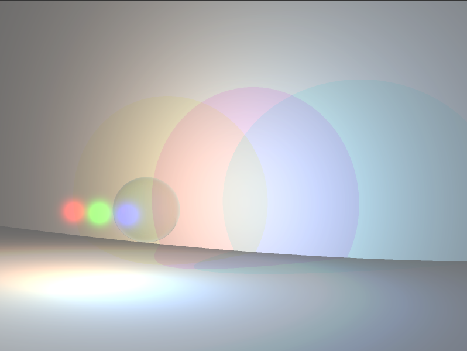
<p align="center">RGB lights add on the ground to give white, and subtract through the glass ball to give black</p>

- Multiple point lights of any RGB color can be added to the scene.
- They can be visualized or hidden, by using the `L` key (see keybindings below).
- Point lights cast hard shadows, and are attenuated by the incidence angle and the distance travelled by the rays.
- An ambiant light of configurable brightness and color is present in every scene, to approximate global illumination in unlit areas.

#### Mesh rendering
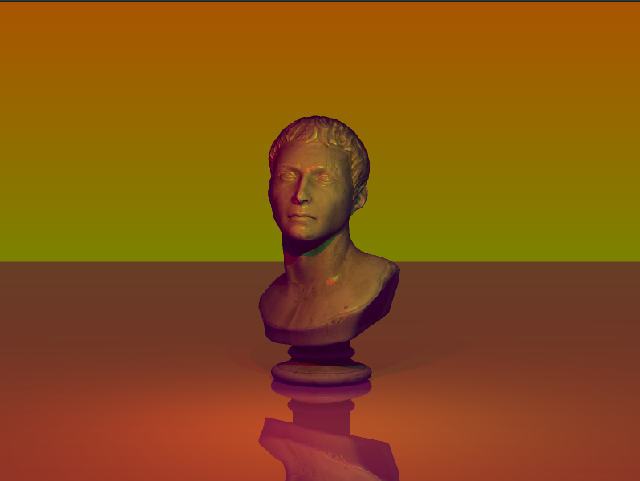
- Load and render meshes in the **.obj** format (standalone loader also available at https://github.com/Samael1254/obj_parser).
- Meshes can be scaled, moved and rotated in the scene configuration file.
- They are rendered using a **Bounding Volume Hierarchy** (BVH) to boost performance.

- ⚠️ Please note that only triangulated meshes can be loaded by miniRT.

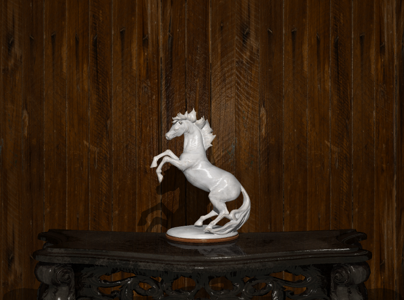
<p align="center">Textures, normal maps and other material properties can be applied to meshes like any other object</p>

#### Transparency
- Transparent materials allow light to pass through.
- Light is refracted through transparent materials according to their refraction index, while some of the light is also reflected as described by Fresnel equations.
- A material only partially transparent will give its color/texture to the light passing through it.

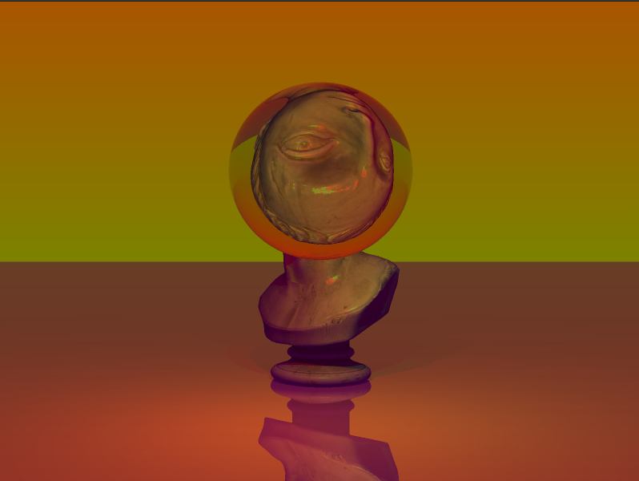
<p align="center">A refracting sphere acting as a distorting lense</p>


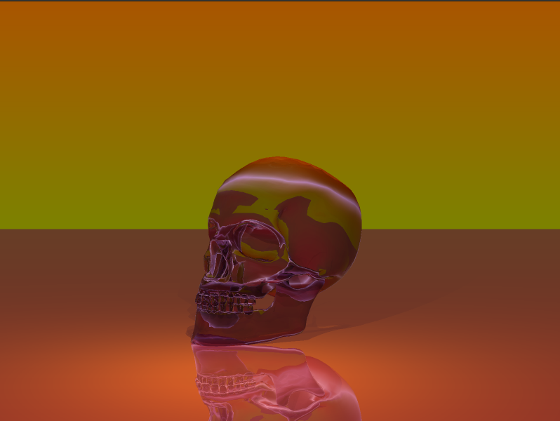
<p align="center">A skull mesh made of red crystal</p>

#### Reflection
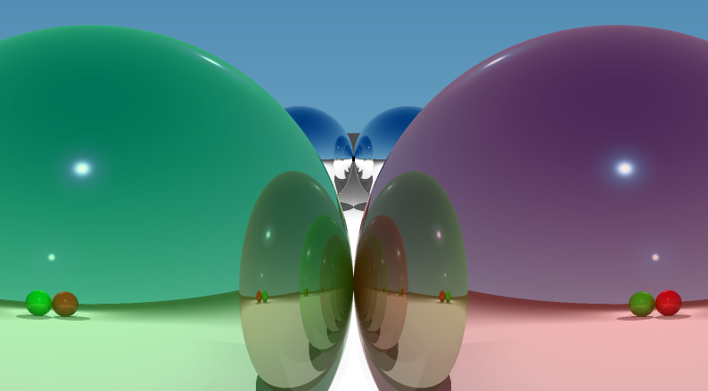
<p align="center"> Rays bounce around several times between the mirrors, creating seemingly infinite reflections</p>

- Reflective materials act as perfect mirrors, but the reflection can be blended with the object color/texture to approximate a partially reflective material.

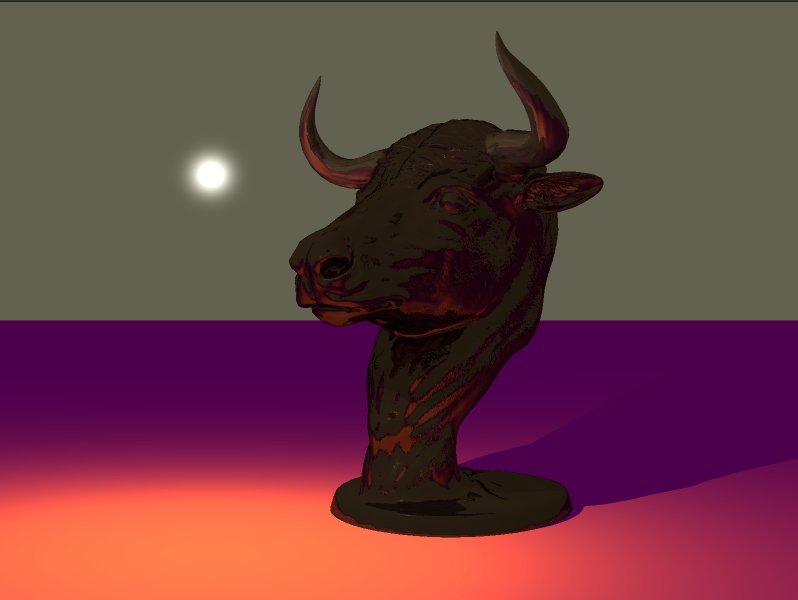
<p align="center">The specular (reflective) color can also be changed to give a material a metallic look</p>

#### Post-processing
- Apply post-processing filters to your scene using the `P` key (see keybindings below), and give a stylish look to your scenes.
<div align="center">
	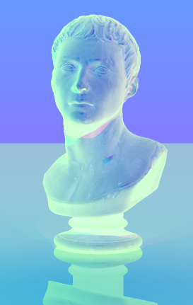
	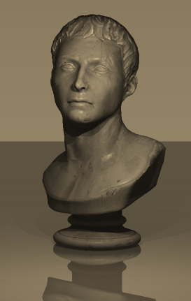
	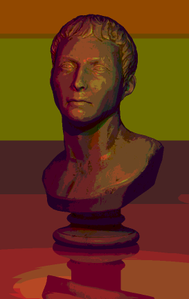
</div>
<p align="center">Negative, sepia and poster filters</p>

#### User Interaction

- The user can move and rotate the camera around in real time to get different views of the scene (see keybindings below)
- Modifiable camera parameters (field of view, movement and rotation speed)
- A FPS counter can be displayed, as well as help for the different keybindings (also listed below)

#### Configuration

- Please refer to the [documentation.rt](https://github.com/Samael1254/miniRT/blob/main/maps/documentation.rt) and [documentation.mrt](https://github.com/Samael1254/miniRT/blob/main/materials/documentation.mrt) files to see how to configure scenes.

## 📦 Installation and usage
Clone and build miniRT at the location of your choice :
```
git clone https://github.com/Samael1254/miniRT.git
cd miniRT
make
```

Launch the program with the scene you want to render as a parameter :
```
./miniRT <scene>.rt
```

## ⌨️ Keybindings

The following keybindings allow the user to interact with miniRT:

- Zoom : Mouse scroll
- Move : WASD
- Rotate : Alt + WASD
- Change movement speed : Up/Down arrows
- Change rotation speed : Left/Right arrows
- Toggle FPS counter : F
- Toggle lights visibility : L
- Toggle anti-aliasing : K
- Next post-process filter : P
- Help : H
- Exit : Escape


## ⏩ Future improvements

##### Parsing
- Set the texture scaling in the .mrt file
- Choose screen size (in .rt file or in command line)
- L->l for lights since there can be several
- Remove the obligation for vectors to be normalized

##### User interaction
- Show maps to select from if miniRT is launched without any map
- Display filter name in the terminal when pressing P

##### Camera movement
- Better movements
- Partial rendering when moving
- Change field of view in real time

##### Materials
- Transparent textures

##### Optimisation
- Post-processing is unnecessarily slow

## ⭕ Known issues
- uv mapping inside an object is upside down
- lights appear through plane-like surfaces
- deformation up and down the screen (fisheye)
- Strong ambiant lighting with weak point lights creates weird shadows
- Light halos and shadow rays are not refracted through transparent materials

## 🫂 Acknowledgements
Made in the context of a project in 42 school.

Graphics library: [minilibx](https://github.com/42Paris/minilibx-linux)
