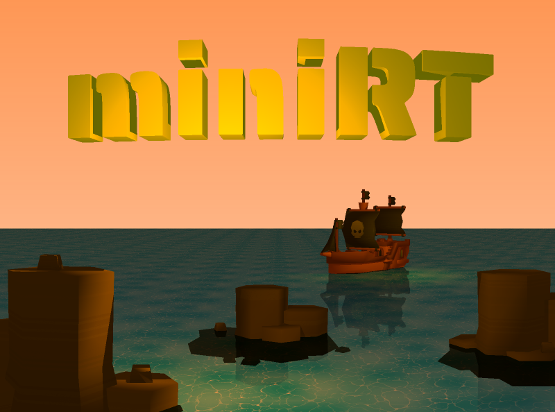

# miniRT

A basic raytracer for 42 school project miniRT.



## *️⃣ Features

Create scenes containing varied shapes, meshes and lights, and render them through the technique of ray-tracing.

Basic shading : hard shadows, incidence and distance attenuation

#### Shapes


Four primitive shapes available: plane, sphere, cylinder, cone.

The shapes are fully customizable : size, position, orientation, etc...

They can be seen from the outside as well as inside.

#### Materials and textures

Materials can be created in dedicated .mrt files, able to load textures and normal maps from .xpm image files (see documentation.mrt for more details)

They contain all the visual parameters of the objects :
- Colors : diffuse, ambiant and specular
- Texture
- Normal map
- Physical properties : specularity, reflectivity, transparency and refractive index


#### Light


#### Mesh rendering
Load and render meshes in the .obj format.

Meshes are rendered with a Bounding Volume Hierarchy (BVH) to boost performance.


#### Transparency

#### Reflection


#### Refraction


- A background sky with a gradient of two colors

#### Post-processing
Apply post-processing filters to your scene


#### User Interaction

The user can move and rotate the camera around in real time to get different views of the scene

A FPS counter can be displayed, as well as help for the different keybindings (also listed below)
- Modifiable camera parameters (field of view, movement and rotation speed)
- Scenes configured in the dedicated .rt file format (see documentation.rt for more details)
- Comes with a few pre-made scenes, meshes, textures and materials to select from

#### Configuration

## 📦 Installation and usage
To clone and build miniRT at the location of your choice :
```
git clone https://github.com/Samael1254/miniRT.git
cd miniRT
make
```

Launch the program with the scene you want to render as a parameter :
```
./miniRT maps/[scene].rt
```

## ⌨️ Keybindings

The following keybindings allow the user to interact with miniRT:

- Zoom : Mouse scroll
- Move : WASD
- Rotate : Alt + WASD
- Change movement speed : Up/Down arrows
- Change rotation speed : Left/Right arrows
- Toggle FPS counter : F
- Toggle lights visibility : L
- Toggle anti-aliasing : K
- Next post-process filter : P
- Help : H
- Exit program : Escape


## ⏩ Future improvements

##### Parsing
- Set the texture scaling in the .mrt file
- Choose screen size (in .rt file or in command line)

##### Camera movement
- Better movements
- Partial rendering when moving
- Change field of view in real time

##### Materials
- Transparent textures

##### Optimisation

## ⭕ Known bugs
- uv mapping inside an object is upside down
- lights appear through plane-like surfaces
- deformation up and down the screen (fisheye)
